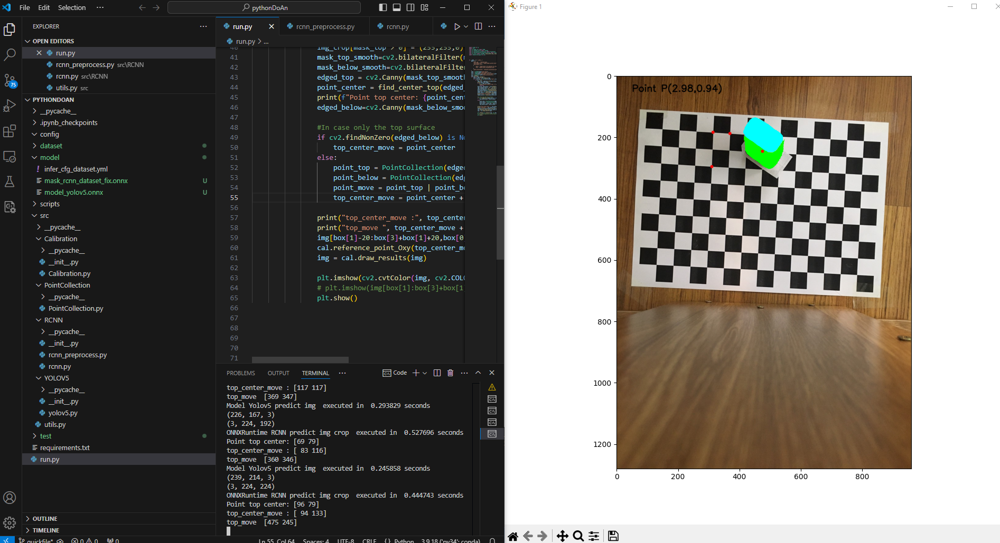

# MonoCameraCplus


## Table of Contents

- [Introduction](#introduction)
- [Installation](#installation)
- [Usage](#usage)
- [Demo](#demo)

## Introduction
Find the coordinates of the center point of the object on the bottom surface. Then convert to the chessboard coordinates corresponding to the reference point.


## Installation

1. **Clone the Repository**:
   ```bash
   
   git clone https://github.com/ngocdu2105/monocamera.git
   cd monocamera
   
2. **Create virtual environment and install**:
   ```bash
   
   pip install -r requirements.txt
## Usage

#### Download ONNX Models and Dataset

Download the ONNX models YOLOv5, RCNN into the `models` directory. And the image dataset from the following Google Drive into `dataset/img`.

**Google Drive Link**: [Download](https://drive.google.com/drive/folders/1y-XrTXRQywmW5O1Tz1JYiJnR0lOq0Iyn?hl=vi)

## Demo
The results obtained are demonstrated as shown in the image below. 
<p align="center">
  
</p>
